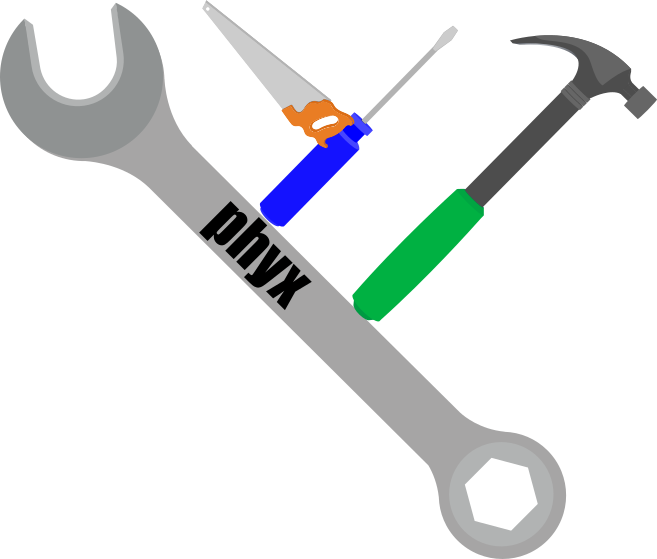

 

**phyx** performs phylogenetics analyses on trees and sequences. See installation instructions for Linux and Mac including any dependencies on the wiki [here](https://github.com/FePhyFoFum/phyx/wiki/Installation) or below. A list of the current programs with examples can be found [here](https://github.com/FePhyFoFum/phyx/wiki/Program-list). See a brief overview [here](https://twitter.com/i/moments/1067839564927008769).

Authors: Joseph W. Brown, Joseph F. Walker, and Stephen A. Smith

Citation: [Brown, J. W., J. F. Walker, and S. A. Smith; Phyx: phylogenetic tools for unix. Bioinformatics 2017; 33 (12): 1886-1888. doi: 10.1093/bioinformatics/btx063](https://academic.oup.com/bioinformatics/article/33/12/1886/2975328/Phyx-phylogenetic-tools-for-unix)

License: GPL https://www.gnu.org/licenses/gpl-3.0.html

Some of the sequence comparison operations use the very nice [edlib library](https://github.com/Martinsos/edlib#alignment-methods). These are reported in this publication: [Martin Šošić, Mile Šikić; Edlib: a C/C ++ library for fast, exact sequence alignment using edit distance. Bioinformatics 2017 btw753. doi: 10.1093/bioinformatics/btw753](https://academic.oup.com/bioinformatics/article/33/9/1394/2964763/Edlib-a-C-C-library-for-fast-exact-sequence).

## Update 31 May 2018
If you have been using phyx and things are not working after a recent pull, this is because of a change in configuration. Please do the following in the `src` directory to remedy the situation:

    make distclean
    autoreconf -fi
    ./configure
    make
    sudo make install

# Installation instructions 
phyx requires a few dependencies. Since installation of these dependencies differs on [Linux](#linux-install) vs. [Mac OSX](#mac-install), we've separated the instructions below. 

## Mac install
Mac has become increasingly difficult to support at the command line with changes every version on location and standards for compilation tools. First, distribution of compiled programs is very difficult. Furthermore, Mac now defaults to clang as a C/C++ compiler, which does not support OpenMP.  For **Mac OSX 10.12**, we have found that you can install with clang using the simple instructions and [homebrew] (http://brew.sh/) *or* using a fresh installation of gcc from [here](http://hpc.sourceforge.net/). Instructions for both are below (don't use both, choose one, probably the simple one). For simple instructions click [here](#binary-install-with-homebrew), and for advanced instructions click [here](#install-with-hpc-gcc-advanced-instructions).

### Binary install with Homebrew

1. Install the Homebrew package manager:

        /usr/bin/ruby -e "$(curl -fsSL https://raw.githubusercontent.com/Homebrew/install/master/install)"

2. Install the Brewsci phyx package:

        brew install brewsci/bio/phyx

### Build from source with Homebrew

1. Install the Homebrew package manager:

        /usr/bin/ruby -e "$(curl -fsSL https://raw.githubusercontent.com/Homebrew/install/master/install)"

2. Install dependencies from homebrew:

        brew install git cmake nlopt armadillo

3. On to phyx. first, clone the repository (if you haven't already):

        git clone https://github.com/FePhyFoFum/phyx.git

4. Install phyx

        cd phyx/src
        ./configure
        make
        python run_tests.py

If you want to install it so it is available anywhere in your system, do:

        sudo make install

### Install with HPC GCC (advanced instructions)
1. Install gcc and gfortran. Download gcc-6.2-bin.tar.gz or more recent from http://hpc.sourceforge.net/. Install with:
    ​     

        sudo tar -xvf gcc-6.2-bin.tar -C /

2. Install autoconf from http://ftp.gnu.org/gnu/autoconf/. Get autoconf-latest.tar.gz, then:

        tar -xzf autoconf-latest.tar.gz
        cd autoconf-2.69
        ./configure --prefix=/usr/local/autoconf-2.69
        make
        sudo make install
        ln -s autoconf-2.69 /usr/local/autoconf
    
3. On to phyx. first, clone the repository (if you haven't already):

        git clone https://github.com/FePhyFoFum/phyx.git

4. Install cmake and install Armadillo. Get cmake from https://cmake.org/download/. I got https://cmake.org/files/v3.6/cmake-3.6.2-Darwin-x86_64.tar.gz. Get armadillo from the `deps` directory or http://arma.sourceforge.net/download.html, get the stable one. Untar it. Double click the Cmake.app. Click "Browse source..." and choose the armadillo folder that was created after untaring. Click "Browse build..." and choose the same folder as browse source. Click "Configure" and then click "Generate". Go to the terminal and browse to that armadillo folder and type:

        make
        sudo make install

5. Install nlopt. Get armadillo from the `deps` directory or go to http://ab-initio.mit.edu/wiki/index.php/NLopt#Download_and_installation and download the latest (probably nlopt-2.4.2.tar.gz). Untar and browse in the terminal to that directory:

        ./configure --without-octave --without-matlab
        make
        sudo make install

6. Compile phyx. Now you can go to the src directory of phyx and type:

        ./configure
        make
        python run_tests.py
        sudo make install

and all the programs should compile without issue. 

## Linux install

These instructions work for most ubuntu versions as well as debian. 

1. Install general dependencies:

        sudo apt-get install git autotools-dev autoconf automake cmake libtool liblapack-dev libatlas-cpp-0.6-dev libnlopt-cxx-dev libnlopt-dev libnlopt0

2. Clone the phyx repo (if you haven't already):

        git clone https://github.com/FePhyFoFum/phyx.git

3. Install armadillo dependency  

**Note**: it is possible to get from apt-get, but need version >= 5.2:

        sudo apt-get install libarmadillo-dev

On debian it was necessary to use backports:

        sudo apt-get -t jessie-backports install libarmadillo-dev

If that is not possible, compile the provided code:

        cd phyx/deps
        tar -xvzf armadillo-7.400.2.tgz
        cd armadillo-7.400.2
        ./configure
        make
        sudo make install

4. Finally, install phyx:

        cd phyx/src
        ./configure
        make
        python run_tests.py

If you want to install it so it is available anywhere in your system, do:

        sudo make install

